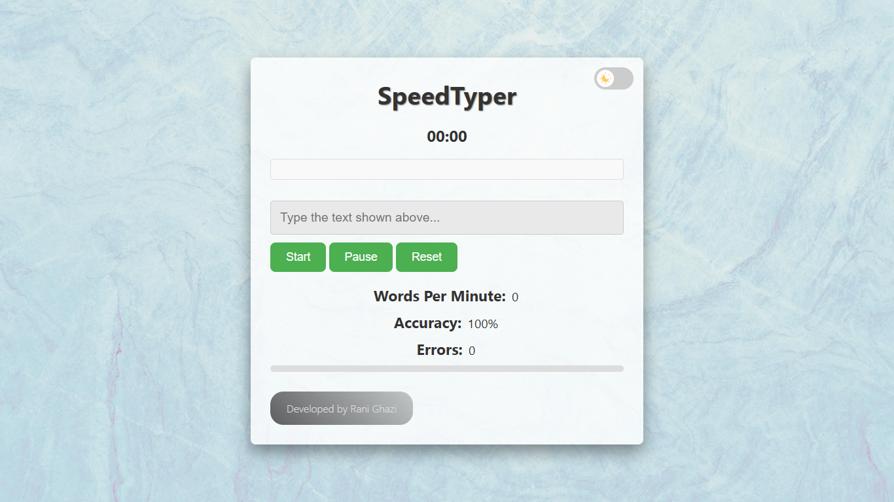
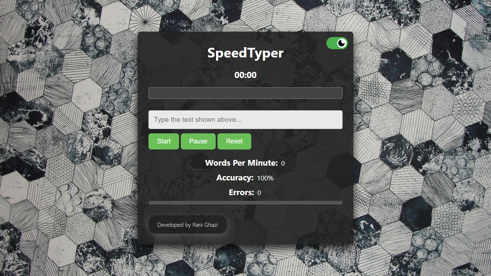
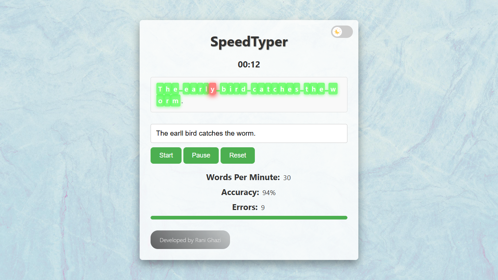
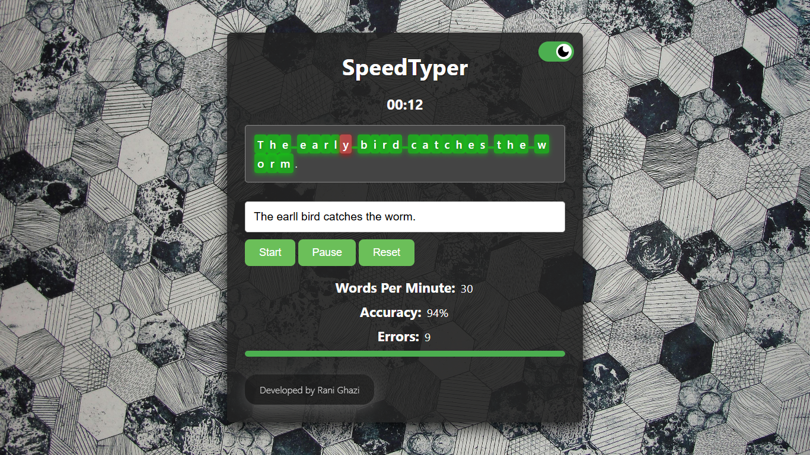

# Typing Speed Test

This project is a website designed to help users improve their typing speed and accuracy. Users can test their typing skills by typing randomly selected sentences and receive real-time feedback on their performance, including typing speed (WPM), accuracy, and error count.

## Key Features
- **Real-time Typing Metrics:** Tracks typing speed (words per minute), accuracy, and errors.
- **Progress Indicator:** Displays a progress bar that shows how much of the sentence is completed.
- **Pause and Resume:** Allows users to pause and resume the test at any time.
- **Error Highlighting:** Highlights errors in real-time to help users identify mistakes.
- **Completion Summary:** Shows a summary modal with final results (WPM, accuracy, errors) at the end of each test.
- **Dark Mode Toggle:** Users can switch between light and dark themes for better visibility and comfort.
- **Responsive Design:** Suitable for both desktop and mobile users.

## Technologies Used
- **Frontend:** HTML, CSS, JavaScript
- **Audio Feedback:** Sound effects for errors and test completion.

## Demo
Check out the live demo [here](https://typingspeed.rf.gd/).

## How to Use
1. Click **Start** to begin the typing test with a randomly selected sentence.
2. Type in the input field and monitor your real-time stats (WPM, accuracy, and errors).
3. Use the **Pause** button to take a break, and **Reset** to restart the test with a new sentence.
4. View your results in a modal at the end of the test, or click **Restart** to start a new session.

## Contributors
Feel free to explore, contribute, and enhance this project to help others improve their typing skills. Your contributions are welcome!

